# 코로나19 전후 국내 마약류사범 단속 추이와 범죄 유형 변화 분석 보고서

## 1. 분석 주제 및 목적

본 프로젝트는 대검찰청의 월별 마약류 통계자료를 이용하여 2017년 1월부터 2025년 12월까지 국내 마약류사범 단속 규모가 시간에 따라 어떻게 변화했는지 확인하고, 코로나19 이전·유행 및 국제이동 제약 시기·이후에 범죄 유형의 구성과 마약류 종류별 단속 추이에 어떤 차이가 나타났는지 분석한다.

분석에서는 코로나19 또는 특정 정책이 변화의 직접적인 원인이라고 미리 단정하지 않는다. 먼저 데이터에서 확인되는 사실(Fact)을 정리하고, 가능한 원인(Why)은 공식자료를 통해 추가 확인하며, 필요한 후속 분석(Action)을 구분하여 제시한다.

---

## 2. 주제 선정 배경

지역 행사에서 경남함께한걸음센터의 마약류 상담·예방 홍보 부스를 접하면서 마약류 문제가 밀반입이나 특정 유흥가에만 한정된 문제가 아니라, 의료용 약물의 오남용, 청소년 노출, 해외의 대마 성분 식품 등 여러 경로를 통해 일상과 연결될 수 있다는 점에 관심을 갖게 되었다.

*지역 행사에서 접한 한국마약퇴치운동본부·식품의약품안전처 마약류 예방 홍보자료*

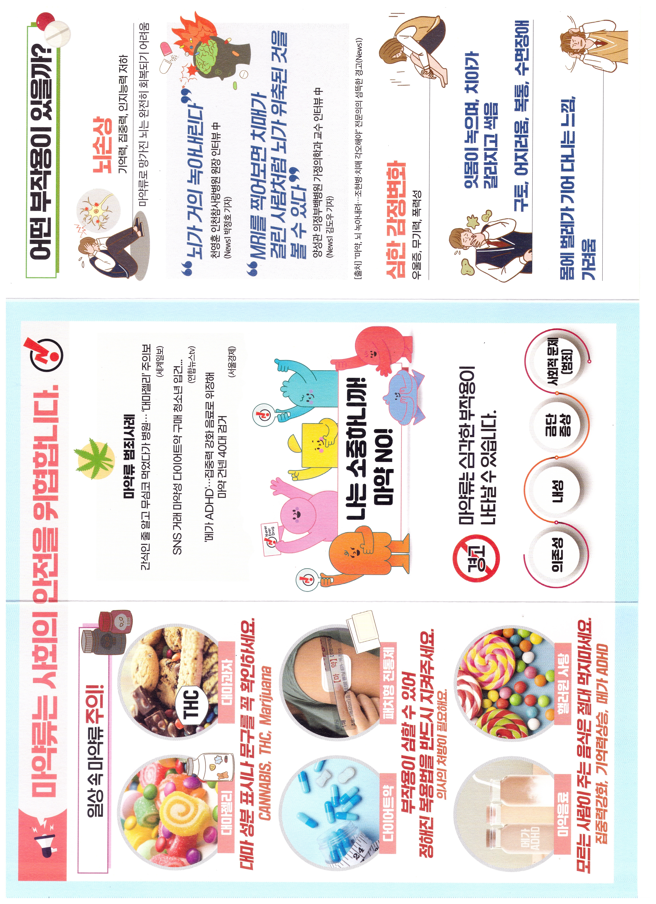

*대마 성분 식품·의약품 등 일상 속 위험 사례를 안내한 예방자료*

예방자료를 통해 의존성·내성·금단증상과 다양한 연령층을 대상으로 한 예방교육이 운영된다는 점을 확인하였다.

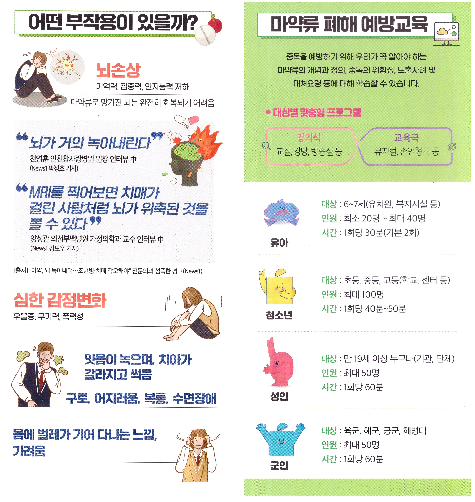

*마약류 부작용과 대상별 예방교육 안내자료*

특히 코로나19 시기에 해외여행과 국제 이동이 크게 줄었다는 점에서 **“이 시기에 국내 마약류사범 단속 규모와 범죄 유형에는 어떤 변화가 있었을까?”**라는 질문이 생겼다. 이를 개인적인 인상이나 기사만으로 판단하지 않고 공공기관의 월별 통계로 확인하기 위해 본 분석을 수행하였다.

---

## 3. 분석 질문

1. 2017~2025년 국내 마약류사범 월별 단속인원은 어떤 추세를 보였는가?
2. 코로나19 이전·유행 및 국제이동 제약 시기·이후의 단속 규모에는 어떤 차이가 있는가?
3. 밀수·밀매·투약·소지 등 범죄 유형의 구성은 시간에 따라 어떻게 변화했는가?
4. 대마·마약·향정신성의약품별 단속 추이에는 어떤 차이가 나타나는가?
5. 급증·급감한 시점은 언제이며, 당시의 수사·단속 강화 또는 사회적 변화와 시기적으로 연결되는가?

---

## 4. 데이터 설명

### 4-1. 핵심 데이터

- 게시기관: 한국마약퇴치운동본부 마약예방교육포털
- 원 출처: 대검찰청
- 자료 형태: 월별 PDF
- 분석 기간: 2017-01 ~ 2025-12
- 원본 PDF 수: 108개
- 핵심 시계열 데이터 포인트: 108개월
- 수집 방법: 한국마약퇴치운동본부 마약예방교육포털의 월별 통계/백서 자료에서 대검찰청 통계를 확인하고, 월별 값과 연간 누계값을 구분하여 분석용 CSV로 정리
- 통계/백서 페이지: https://drugfree.or.kr/portal/kor/M467848284/board.do
- 이용 주의: 공개 통계의 재이용·저작권 조건은 게시기관 및 원 출처의 최신 이용정책을 확인하며, 본 프로젝트는 교육 목적의 분석으로 출처를 명시한다.
- 주요 항목:
  - 전체 마약류사범 단속인원
  - 대마
  - 마약
  - 향정신성의약품
  - 밀조
  - 밀수
  - 밀매
  - 밀경
  - 투약
  - 소지
  - 기타

### 4-2. 분석 구간

- 코로나 이전: 2017-01 ~ 2019-12
- 코로나19 유행·국제이동 제약 시기: 2020-01 ~ 2022-12
- 코로나 이후: 2023-01 ~ 2025-12

이 구간은 분석 편의를 위해 나눈 것으로, 각 구간의 차이가 코로나19 때문에 발생했다고 단정하기 위한 구분은 아니다.

---

## 5. 데이터 정제 및 검증

### 5-1. 정제 목적

원본 자료는 108개의 월별 PDF로 나뉘어 있고, 일부 연도는 월별 값과 누계값의 표 구성이 다르다. 이를 그대로 비교하면 같은 수치를 중복 집계하거나 누계값을 월별 값으로 잘못 사용할 수 있다. 따라서 날짜·항목명·월별 값·누계값·중복·결측치·이상치를 확인한 뒤 분석용 CSV로 정리하였다.

### 5-2. 월별 값과 누계값 구분

이번 분석에서는 각 달에 실제로 집계된 **월별 값**을 사용하였다.

예를 들어 3월 보고서에 1~3월 누계가 함께 있다면, 3월의 시계열 값에는 3월 한 달의 값만 사용한다. 누계값을 월별 값으로 사용하면 앞선 달의 수치가 반복 포함되어 시간에 따른 변화가 왜곡되기 때문이다.

### 5-3. 정제 결과

- 핵심 월별 데이터 행 수: 108행
- 중복 데이터: 0건
- 핵심 월별 데이터 결측치: 0건
- 검증식 `대마 + 마약 + 향정신성의약품 = 전체 단속인원`: 108개월 모두 일치
- 2019년 월별 합계와 공식 연간 누계 사이 2명 차이 발견
  - 월별 분석에서는 월별 표의 공개 값을 그대로 유지
  - 임의 수정하지 않고 원자료 불일치 가능성으로 기록
- 2018년 범죄 유형별 연간 값은 원자료 내부 불일치가 있어 임의 추정하지 않고 보조 분석에서 결측으로 유지

### 5-4. IQR을 이용한 이상치 확인

**IQR(Interquartile Range, 사분위범위)**은 데이터를 작은 값부터 큰 값까지 정렬했을 때 가운데 50%가 포함되는 범위이다. `Q3 - Q1`로 계산하며, 다른 값들과 지나치게 멀리 떨어져 있는 값을 **이상치 후보**로 확인할 때 사용한다.

이번 데이터에서는:

- Q1: 1,110.50명
- Q3: 1,885.75명
- IQR: 775.25명
- 상한: 약 3,048.63명

따라서 다음 4개 월이 이상치 후보로 확인되었다.

| 시점 | 전체 단속인원 |
|---|---:|
| 2019-05 | 3,091명 |
| 2023-07 | 4,220명 |
| 2023-08 | 3,715명 |
| 2025-07 | 3,221명 |

이 값들은 자동 삭제하지 않았다. 마약류 단속자료에서 급증은 입력 오류가 아니라 실제 대형 사건, 집중 단속, 수사 확대 또는 집계 변화와 관련된 중요한 정보일 수 있기 때문이다. 따라서 이상치 후보는 제거 대상이 아니라 추가 검증 대상으로 다루었다.

---

## 6. 적용한 시계열 분석 방법

### 6-1. 12개월 이동평균

월별 단속인원의 일시적인 출렁임을 완화하고 1년 단위의 장기 흐름을 보기 위해 12개월 이동평균을 적용하였다.

### 6-2. 전년 동월 대비 변화율(YoY)

전월 대비 변화는 계절적 영향을 크게 받을 수 있으므로 같은 달을 전년도와 비교하는 전년 동월 대비 변화율을 사용하였다.

### 6-3. 구간별 평균

코로나 이전·유행 및 제약 시기·이후의 월평균 단속인원을 비교하였다.

### 6-4. 범죄 유형별 구성비

연간 전체 마약류사범 중 밀조·밀수·밀매·밀경·투약·소지·기타가 차지하는 비율을 계산하였다.

### 6-5. 달력 월별 평균

2017~2025년 동안 같은 달의 값을 모아 평균을 계산하여 반복되는 월별 패턴이 있는지 확인하였다. 다만 이상치의 영향을 함께 점검하여 단순 평균만으로 계절성을 단정하지 않았다.

### 6-6. 시계열 분해(보너스)

보너스 과제로 12개월 주기의 **가법적 시계열 분해**를 적용하였다. 원자료를 `추세(Trend) + 계절성(Seasonality) + 잔차(Residual)`로 나누어, 장기적인 상승 흐름과 반복되는 월별 패턴, 그리고 두 요소만으로 설명되지 않는 급격한 변화를 구분하였다.

추세는 중앙 정렬된 2×12 이동평균으로 계산하고, 계절성은 추세를 제거한 값에서 같은 달의 평균 효과를 계산하였다. 잔차는 `원자료 - 추세 - 계절성`으로 계산하였다.

---

## 7. 분석 결과 및 시각화

### 7-1. 월별 마약류사범 단속 추이

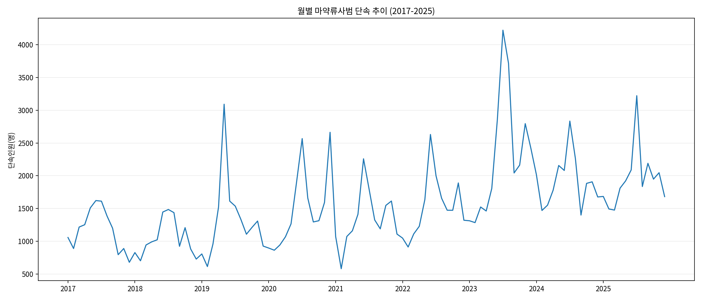

전체 기간에서 가장 높은 월은 2023년 7월 4,220명이었다. 그다음은 2023년 8월 3,715명, 2025년 7월 3,221명, 2019년 5월 3,091명 순이었다.

월별 값의 변동이 크기 때문에 단일 월만으로 장기 추세를 판단하기보다 이동평균과 함께 볼 필요가 있다.

### 7-2. 12개월 이동평균

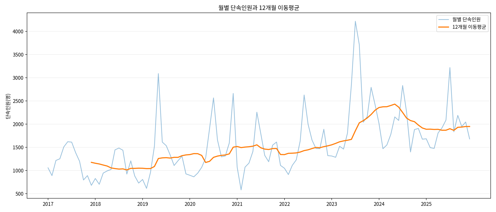

12개월 이동평균은 2018년 9월 약 1,013.3명 수준에서 낮게 나타난 뒤 장기적으로 상승하였다. 이동평균의 최고점은 2024년 5월 약 2,432.8명이었다.

이는 특정 한 달의 급증만이 아니라 여러 달의 높은 단속인원이 누적되면서 2023~2024년 장기 수준 자체가 과거보다 높아졌음을 보여준다.

### 7-3. 범죄 유형별 구성비

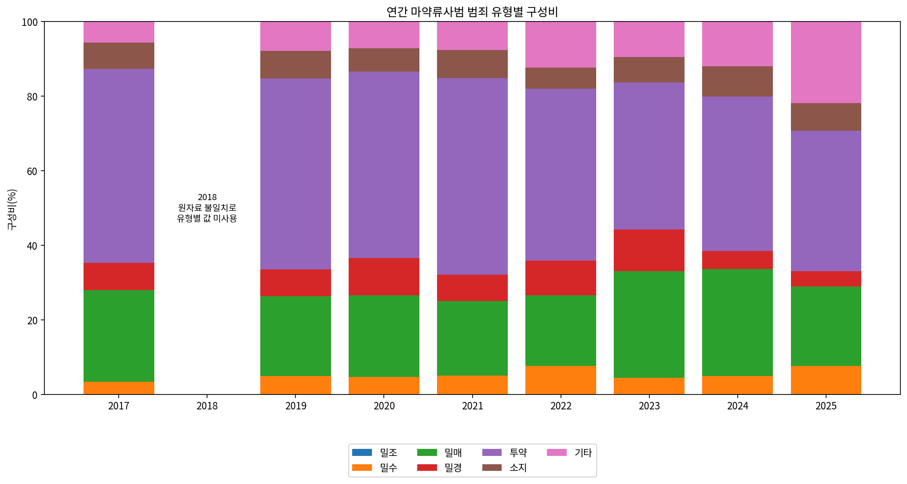

2018년은 원자료 내부 불일치 때문에 유형별 값을 사용하지 않았다.

확인 가능한 연도에서 투약 비중은 2017년 약 52.0%에서 2025년 약 37.6%로 낮아졌다. 반면 밀매 비중은 2023년과 2024년에 각각 약 28.6%로 높게 나타났다. 2025년에는 `기타` 비중이 약 21.8%까지 확대되었다.

따라서 단순히 전체 단속인원만 증가한 것이 아니라 단속된 범죄 유형의 구성도 시기에 따라 달라졌음을 확인할 수 있다.

### 7-4. 코로나 이전·유행 및 제약 시기·이후 평균 비교

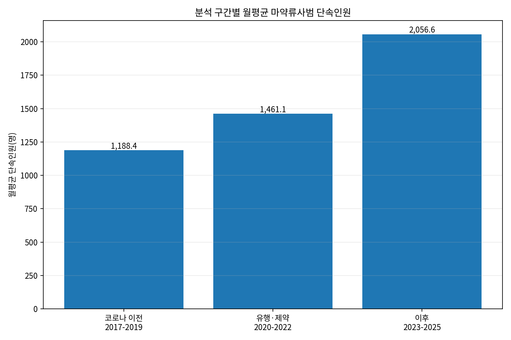

| 분석 구간 | 월평균 단속인원 |
|---|---:|
| 코로나 이전(2017~2019) | 1,188.4명 |
| 유행·제약 시기(2020~2022) | 1,461.1명 |
| 이후(2023~2025) | 2,056.6명 |

세 구간의 월평균은 뒤 시기로 갈수록 높아졌다.

그러나 이 결과는 **기간별 관찰값의 차이**이며, 코로나19가 직접적으로 단속인원을 증가시켰다는 의미는 아니다. 실제 범죄 규모 변화와 수사·단속 강화가 동시에 영향을 줄 수 있기 때문이다.

### 7-5. 마약류 종류별 월간 추이

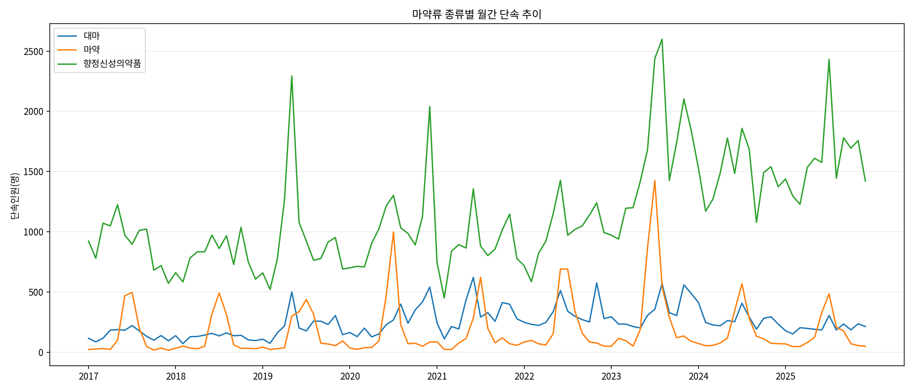

108개월 전체 합계는 다음과 같다.

| 종류 | 단속인원 합계 | 전체에서 차지하는 비율 |
|---|---:|---:|
| 대마 | 26,550명 | 약 15.7% |
| 마약 | 18,897명 | 약 11.2% |
| 향정신성의약품 | 123,969명 | 약 73.2% |
| 전체 | 169,416명 | 100% |

향정신성의약품은 108개월의 모든 달에서 대마와 마약보다 높은 단속인원을 기록하였다. 전체 단속인원의 큰 폭 증감 역시 향정신성의약품의 증감과 함께 나타나는 경우가 많았다.

### 7-6. 전년 동월 대비 변화율

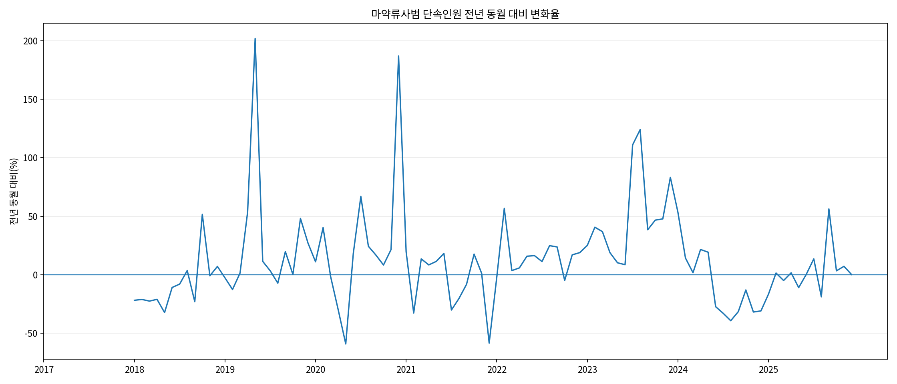

가장 큰 증가 후보는 다음과 같다.

- 2019년 5월: 약 +201.9%
- 2020년 12월: 약 +187.0%
- 2023년 8월: 약 +124.1%
- 2023년 7월: 약 +111.0%

큰 감소 후보는 다음과 같다.

- 2020년 5월: 약 -59.0%
- 2021년 12월: 약 -58.3%

전년 동월 대비 변화율은 급격한 변화 시점을 찾는 데 유용하지만, 증가·감소의 원인은 해당 시기의 수사·단속 정책과 실제 범죄 동향을 별도로 확인해야 한다.

### 7-7. 달력 월별 평균과 계절성 후보

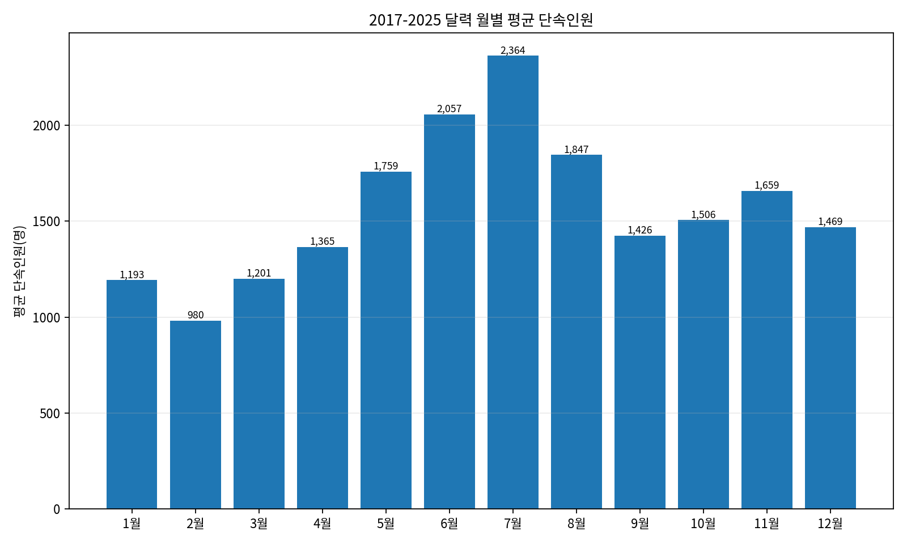

9년 평균에서는 7월이 약 2,363.8명으로 가장 높고 2월이 약 980.4명으로 가장 낮았다.

다만 IQR 이상치 4개를 제외하고 다시 계산하면 6월 평균이 약 2,056.6명으로 가장 높고, 7월은 약 1,976.1명으로 그다음이었다. 월별 중앙값에서도 6월 2,081명, 7월 2,000명 순이었다.

따라서 **여름철, 특히 6~7월에 높은 값이 나타나는 경향은 관찰되지만, 단순히 “7월에 항상 단속이 많다”는 계절성으로 확정하기는 어렵다.** 일부 연도의 대규모 급증이 평균을 크게 끌어올리기 때문이다.

---

## 8. 주요 인사이트: Fact → Why → Action

### 인사이트 1. 장기적인 단속 수준은 과거보다 높아졌다

**Fact**

코로나 이전(2017~2019)의 월평균 단속인원은 1,188.4명이었고, 2020~2022년에는 1,461.1명, 2023~2025년에는 2,056.6명으로 높아졌다. 12개월 이동평균도 2018년 9월 약 1,013.3명에서 2024년 5월 약 2,432.8명까지 상승하였다.

**Why — 가능한 해석**

이 증가는 실제 마약류 범죄의 확대뿐 아니라 수사·단속 역량 강화의 영향을 함께 받았을 가능성이 있다. 정부는 2023년 4월 검찰·경찰·관세청 등 840명 규모의 마약범죄 특별수사본부를 구성하였다. 대검찰청은 2023년 1~10월 마약사범 22,393명이 단속되어 전년 동기보다 약 47% 증가했고, 압수량도 43.2% 증가했다고 발표하였다.

따라서 단속인원 증가를 곧바로 실제 마약 사용 인구의 증가로 동일시해서는 안 된다.

**Action**

향후 마약류 압수량, 수사·단속 인력, 특별단속 기간을 함께 비교하여 `실제 범죄 규모 변화`와 `단속 강도 변화`를 구분하는 추가 분석이 필요하다.

---

### 인사이트 2. 2023년 7~8월 급증은 단순한 오류로 보기 어렵다

**Fact**

2023년 7월은 4,220명으로 전체 108개월 중 가장 높았고, 8월은 3,715명으로 두 번째로 높았다. 전년 동월 대비로는 각각 약 +111.0%, +124.1%였다. 두 달 모두 IQR 기준 이상치 후보이지만 원자료 검증식에는 문제가 없었다.

**Why — 가능한 해석**

2023년에는 범정부 차원의 단속 강화가 진행되었다. 같은 해 4월 마약범죄 특별수사본부가 출범했으며, 대검찰청은 2023년 1~10월 단속인원이 전년 동기보다 약 47% 증가했다고 발표하였다. 이후 공식자료에서도 2023년 밀매사범 7,904명과 투약사범 10,899명이 당시 역대 최대 수준으로 집계되었다.

이는 2023년 급증이 단순 입력 오류가 아니라 실제 범죄 동향과 강화된 단속 활동이 함께 반영된 결과일 가능성을 보여준다. 다만 7월과 8월의 급증을 특정 정책 하나의 결과로 단정할 수는 없다.

**Action**

2023년 6~8월의 기관별 집중단속 실적, 대형 사건, 압수량 및 범죄 유형별 월간 자료를 추가 확인하면 급증 원인을 더 구체적으로 검증할 수 있다.

---

### 인사이트 3. 향정신성의약품이 전체 단속 추이를 주도한다

**Fact**

108개월 전체 단속인원 169,416명 중 향정신성의약품은 123,969명으로 약 73.2%를 차지하였다. 대마는 약 15.7%, 마약은 약 11.2%였다. 또한 108개월 모든 달에서 향정신성의약품 단속인원이 다른 두 종류보다 많았다.

**Why — 가능한 해석**

전체 마약류사범 추세를 해석할 때 세 종류를 동일한 비중으로 보는 것보다 향정신성의약품의 변화가 전체 수치를 크게 움직일 수 있다는 점을 고려해야 한다.

다만 현재 데이터는 `단속인원`이므로 향정신성의약품의 실제 사용량이나 유통량이 전체의 73.2%라는 뜻은 아니다.

**Action**

향정신성의약품 안에서도 필로폰·합성마약·의료용 향정신성의약품 등 세부 유형을 구분할 수 있는 공식자료를 추가하면 어떤 세부 품목이 증가를 주도했는지 확인할 수 있다.

---

### 인사이트 4. 범죄 유형의 구성도 변화했다

**Fact**

투약 비중은 2017년 약 52.0%에서 2025년 약 37.6%로 낮아졌다. 반면 밀매 비중은 2023년과 2024년에 약 28.6%로 높았으며, 2025년에는 `기타`가 약 21.8%까지 확대되었다.

**Why — 가능한 해석**

전체 단속 규모뿐 아니라 수사기관이 적발한 범죄의 유형 자체가 변하고 있을 가능성이 있다. 2024년 대검찰청 자료도 2023년 밀매사범과 투약사범이 크게 증가했다가 2024년에 감소했다고 설명한다.

다만 `기타` 범주의 구성 정의가 시기별로 동일한지 확인하지 않으면 2025년 기타 비중 확대의 의미를 정확히 해석하기 어렵다.

**Action**

대검찰청 범죄백서의 범죄 유형 분류기준과 `기타` 항목의 세부 정의를 확인하고, 가능하다면 연령대·직업·외국인 여부와 교차 분석한다.

---

### 인사이트 5. 7월 평균이 가장 높지만 ‘7월 계절성’으로 단정할 수 없다

**Fact**

원자료 전체 평균에서는 7월이 약 2,363.8명으로 가장 높았다. 그러나 IQR 이상치 후보를 제외하면 6월 평균이 약 2,056.6명으로 가장 높고 7월은 약 1,976.1명으로 낮아진다. 중앙값 역시 6월 2,081명, 7월 2,000명으로 6월이 더 높다.

**Why — 가능한 해석**

2019년 5월, 2023년 7~8월, 2025년 7월과 같은 큰 급증이 특정 달의 평균을 크게 끌어올렸다. 따라서 평균 막대그래프만 보면 실제보다 강한 계절성이 있는 것처럼 보일 수 있다.

**Action**

계절성을 더 정확하게 확인하려면 월별 평균뿐 아니라 중앙값, 이상치 제외 결과, 시계열 분해 결과를 함께 비교한다. 이는 보너스 과제의 `시계열 분해`로 확장하기 좋은 부분이다.

---

## 9. 외부 공식자료를 이용한 해석 검증

원인 가설은 데이터의 시기적 일치만으로 결론 내리지 않고 다음 공식자료를 추가 확인하였다.

1. **대한민국 정책브리핑, 2023-04-18**
   - 검찰·경찰·관세청 등 **840명 규모의 마약범죄 특별수사본부** 구성
   - 범정부 수사역량 결집 및 의료용 마약류 불법유통 감시 강화 계획
   - https://www.korea.kr/news/policyNewsView.do?newsId=148913991

2. **대검찰청 마약범죄 특별수사본부 제3차 회의 자료, 2023-12-06**
   - 2023년 1~10월 마약사범 **22,393명**
   - 전년 동기 15,182명 대비 **약 47% 증가**
   - 같은 기간 마약류 압수량은 909.7kg으로 전년 동기 대비 **43.2% 증가**
   - https://www.spo.go.kr/common/board/Download.do?bcIdx=1043896&cbIdx=1403&streFileNm=94845a0d-d7da-449f-a131-fc69a1e5ef0e.pdf

3. **대검찰청 2024년 마약범죄 주요 현황**
   - 2023년 밀매사범 **7,904명**으로 당시 역대 최대
   - 2023년 투약사범 **10,899명**으로 당시 역대 최대
   - 2024년에는 밀매·투약 사범이 전년보다 감소
   - https://www.spo.go.kr/common/board/Download.do?bcIdx=1072791&cbIdx=1403&streFileNm=52d03147-445a-4f9b-a19d-51913ce7298f.pdf

4. **국무조정실 범정부 마약류 특별단속, 2025-04-16**
   - 2025년 4월 16일~6월 15일, 60일간 특별단속
   - 해외 밀반입·국내 유통·의료용 마약류 오남용을 중점 단속
   - https://m.korea.kr/briefing/pressReleaseView.do?newsId=156684484

5. **관세청 여름 휴가철 마약류 밀반입 집중단속, 2025-07-17 발표**
   - 2025년 7월 21일~8월 31일, 여행자휴대품을 통한 마약류 밀반입 집중단속
   - https://www.customs.go.kr/kcs/na/ntt/selectNttInfo.do?bbsId=1362&mi=2891&nttSn=10146083&nttSnUrl=54675da17ddeefdb5407f0270d57bf22

이 자료들은 **단속 규모가 실제 범죄 동향뿐 아니라 수사·단속 강도의 영향을 받을 수 있다**는 해석을 뒷받침한다. 다만 특정 월의 단속인원 증가가 특정 정책 하나 때문에 발생했다고 직접 증명하는 자료는 아니므로 인과관계로 표현하지 않는다.
---

## 10. 보너스 과제 — 시계열 분해

### 10-1. 분해 목적

달력 월별 평균에서는 7월의 평균 단속인원이 가장 높게 나타났지만, 일부 큰 급증값이 평균을 끌어올렸을 가능성이 확인되었다. 이를 한 단계 더 검증하기 위해 원자료를 **추세(Trend), 계절성(Seasonality), 잔차(Residual)**로 분리하였다.

### 10-2. 원자료(Observed)

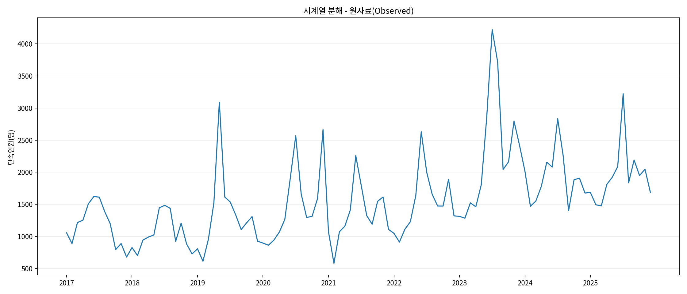

원자료는 월별 변동 폭이 크며 2019년 5월, 2020년 12월, 2023년 7~8월, 2025년 7월과 같은 급증 구간이 눈에 띈다.

### 10-3. 추세(Trend)

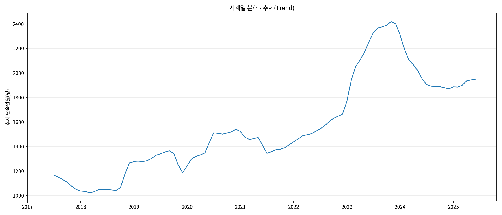

중앙 정렬된 2×12 이동평균으로 계산한 추세는 **2018년 3월 약 1,024.7명**에서 낮게 나타났고, 이후 장기적으로 상승하여 **2023년 11월 약 2,418.3명**으로 가장 높게 추정되었다.

기존 12개월 이동평균 그래프의 최고 시점(2024년 5월)과 분해 추세의 최고 시점(2023년 11월)이 다른 이유는 계산 방식이 다르기 때문이다. 기존 이동평균은 뒤 12개월을 이용한 이동평균이고, 분해 추세는 시점의 앞뒤 데이터를 함께 사용하는 **중앙 정렬 이동평균**이다.

### 10-4. 계절성(Seasonality)

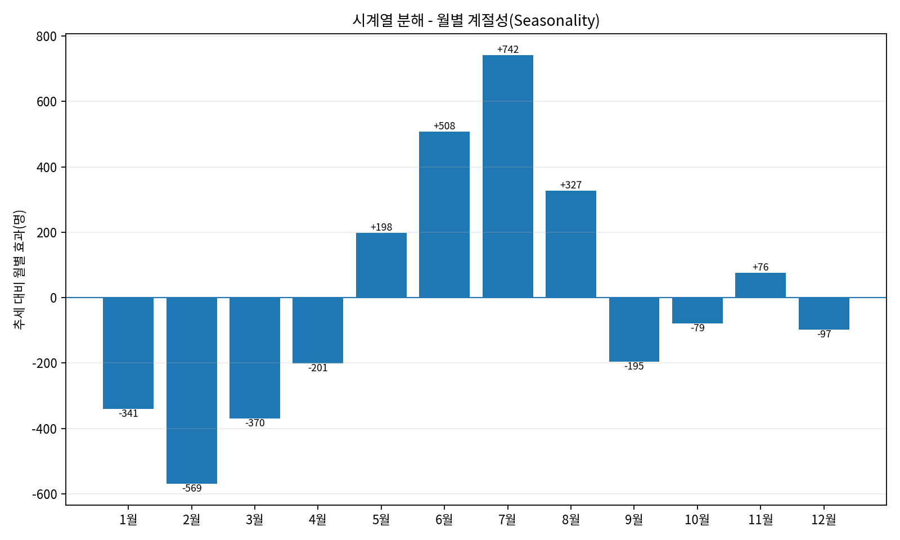

| 월 | 계절 효과(명) |
|---|---:|
| 1월 | -340.6 |
| 2월 | -569.2 |
| 3월 | -369.5 |
| 4월 | -200.6 |
| 5월 | +198.4 |
| 6월 | +508.2 |
| 7월 | +742.1 |
| 8월 | +327.0 |
| 9월 | -195.4 |
| 10월 | -79.3 |
| 11월 | +76.2 |
| 12월 | -97.4 |

분해 결과에서는 **7월이 추세보다 약 +742.1명**, **6월이 약 +508.2명** 높게 나타나는 계절 효과가 추정되었다. 반대로 **2월은 약 -569.2명**으로 가장 낮았다.

그러나 이 계절성 추정치 역시 9년의 제한된 자료와 큰 급증값의 영향을 받을 수 있으므로, “매년 7월이면 반드시 단속이 증가한다”는 의미로 해석하지 않는다.

### 10-5. 잔차(Residual)

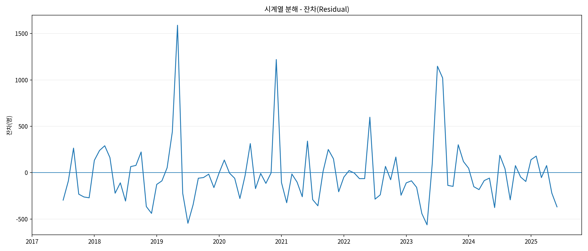

추세와 계절성을 제거한 뒤에도 큰 양(+)의 잔차가 남은 대표 시점은 다음과 같다.

- 2019-05: 약 **+1,589.7명**
- 2020-12: 약 **+1,219.9명**
- 2023-07: 약 **+1,147.7명**
- 2023-08: 약 **+1,020.8명**

특히 2023년 7~8월은 여름철 계절 효과를 고려한 뒤에도 큰 잔차가 남았다. 따라서 해당 급증은 **일반적인 여름철 패턴만으로 설명하기 어렵고**, 당시의 범죄 동향·집중단속·대형 사건 등 별도의 요인을 추가로 확인할 필요가 있다.

### 10-6. 보너스 과제 결론

시계열 분해를 통해 본 분석에서 관찰된 변화가 세 가지 층으로 나뉜다는 점을 확인하였다.

1. **추세:** 2018년 이후 장기적인 단속 수준 상승
2. **계절성:** 6~8월에 상대적으로 높은 월별 효과
3. **잔차:** 2019-05, 2020-12, 2023-07~08처럼 추세·계절성만으로 설명되지 않는 급격한 변화

따라서 단순 꺾은선그래프에서 보이는 급등을 모두 같은 원인으로 해석하기보다, 장기 추세·반복 패턴·예외적 변화를 나누어 보는 것이 더 적절하다.

분해 결과의 재현을 위해 `data/processed/decomposition_2017_2025.csv`도 함께 저장하였다.

---

## 11. 보너스 과제 — Dashboard 탐색 기능

시계열 분석 결과를 실제로 탐색할 수 있도록 **정적 웹 Dashboard**를 추가 구현하였다. 이 기능은 과제의 보너스 요구사항인 “기간/조건을 바꿔보며 탐색 가능한 대시보드”를 위한 것이다.

### 11-1. 구현 방식

- HTML / CSS / JavaScript만 사용한 정적 웹페이지
- 분석용 CSV를 `data.js`로 변환하여 브라우저에서 사용
- 서버·데이터베이스·AI API 불필요
- API Key 및 별도 사용료 없음

### 11-2. 제공 기능

- 전체 / 코로나 이전 / 유행·제약 / 이후 기간 빠른 선택
- 시작 월·종료 월 직접 변경
- 전체 단속인원 / 향정신성의약품 / 대마 / 마약 선택
- 12개월 이동평균 표시 여부 변경
- 선택 기간 데이터 수·월평균·최고 월 자동 계산
- 달력 월별 평균 비교
- 현재 조건의 Top 5 월 확인
- 연도별 범죄 유형 구성비 확인

### 11-3. 필터 변경 시나리오

**시나리오 A — 전체 기간 확인**

- 기간: 2017-01 ~ 2025-12
- 지표: 전체 단속인원
- 목적: 9년의 장기 추세와 주요 급증 시점 확인

**시나리오 B — 코로나 이후 확인**

- 기간: 2023-01 ~ 2025-12
- 지표: 전체 단속인원
- 목적: 2023년 7~8월 급증과 이후 높은 단속 수준 확인

**시나리오 C — 유행·제약 시기 향정 확인**

- 기간: 2020-01 ~ 2022-12
- 지표: 향정신성의약품
- 목적: 전체 단속 추이에 큰 비중을 차지한 향정신성의약품의 해당 기간 흐름 확인

### 11-4. 제출 및 배포

Dashboard 원본은 `dashboard/`에, GitHub Pages 배포용 동일 파일은 `docs/`에 저장하였다. GitHub Pages에서 `main /docs`를 배포 소스로 선택하면 정적 사이트로 게시할 수 있다.

실제 배포 URL은 GitHub 업로드 후 README에 추가한다.

---

## 12. 결론

2017년부터 2025년까지 108개월의 대검찰청 월별 자료를 분석한 결과, 국내 마약류사범 단속 수준은 장기적으로 높아지는 흐름을 보였다. 2023년 7~8월에는 매우 큰 급증이 나타났고, 이후 12개월 이동평균 역시 과거보다 높은 수준을 유지하였다.

종류별로는 향정신성의약품이 전체 단속인원의 약 73.2%를 차지해 전체 추이를 주도하는 핵심 항목으로 나타났다. 범죄 유형별로는 투약 비중이 장기적으로 낮아지는 반면, 2023~2024년 밀매 비중이 높게 나타나는 등 구성 변화도 확인되었다.

또한 7월의 단순 평균이 가장 높았지만 이상치 제거와 중앙값 비교에서는 6월이 더 높게 나타났다. 이는 시계열 분석에서 평균 그래프만 보고 계절성을 단정하기보다 이상치와 다른 통계값을 함께 확인해야 한다는 점을 보여준다.

따라서 이번 분석의 핵심 결론은 `마약류 단속인원이 증가했다`는 사실뿐 아니라, **장기 추세·범죄 유형·마약류 종류·급증 시점·통계적 이상치를 함께 보아야 변화의 의미를 더 정확하게 이해할 수 있다**는 것이다.

---

## 13. 한계점

- 마약류사범 단속인원의 증가는 실제 국내 마약 사용 인구 또는 유통량의 증가와 동일하지 않다.
- 단속실적은 수사기관의 인력, 정책, 집중단속, 적발기술 변화 등의 영향을 받을 수 있다.
- 2018년 범죄 유형별 연간 자료는 원자료 내부 불일치 때문에 세부 값을 사용하지 못했다.
- 2019년 월별 합계와 공식 연간 누계 사이에 2명의 차이가 있으며, 임의 수정하지 않았다.
- 코로나19 기간 구분은 분석 편의를 위한 것이며 인과관계를 증명하지 않는다.
- 달력 월별 평균은 일부 큰 급증값의 영향을 받으므로 계절성을 확정하기에는 부족하다.
- 현재 분석은 단속인원을 중심으로 하며, 압수량·가격·순도·수사인력·온라인 유통 규모 등은 함께 분석하지 않았다.

---

## 14. AI 사용 로그

| 사용 작업 | 사용 이유 | 검증 방법 |
|---|---|---|
| 분석 주제와 질문 구조 정리 | 분석 범위를 명확히 하기 위해 | 과제 요구사항과 실제 확보 데이터 비교 |
| 월별 자료 정리 방법 검토 | 108개 자료의 반복 작업을 줄이기 위해 | 원본 PDF 표와 샘플 대조 |
| Python 코드 초안 작성·검토 | CSV 생성과 그래프 생성을 자동화하기 위해 | 108개월 검증식 및 코드 재실행 |
| 결측치·이상치 처리 방법 검토 | 임의 삭제를 피하기 위해 | IQR 계산 후 원자료와 비교 |
| 시각화 방법 제안 | 각 질문에 적합한 그래프를 선택하기 위해 | 그래프와 원 데이터 수치 비교 |
| 시계열 분해 코드 작성·검토 | 추세·계절성·잔차를 분리해 보너스 과제를 수행하기 위해 | 분해 성분을 CSV로 저장하고 원자료·계산식과 재검증 |
| Dashboard 구현 | 기간·조건을 바꾸며 결과를 탐색하기 위해 | Dashboard 계산값을 원본 CSV와 비교 |
| Fact–Why–Action 초안 작성 | 관찰과 해석을 분리하기 위해 | Why 부분은 공식기관 자료로 추가 검색·검증 |
| 문장 표현 보완 | 보고서 가독성을 높이기 위해 | 최종 결론을 데이터 수치와 다시 대조 |

AI가 제안한 원인이나 사건은 그대로 결론으로 사용하지 않았다. 특히 2023년 급증과 단속 강화의 관계는 공식 보도자료로 시기적 관련성을 확인했지만, 직접적인 인과관계로 단정하지 않았다.

---

## 15. 다음 단계

1. 대검찰청 범죄백서에서 2023년 7~8월 급증과 관련된 세부 단속 또는 사건 자료 추가 확인
2. 2025년 7월 급증과 2025년 특별단속의 관계 추가 검증
3. `기타` 범죄 유형의 정의와 2025년 비중 확대 원인 확인
4. Dashboard를 GitHub Pages에 배포하고 실제 URL 기록
5. 제출 전 GitHub에서 README·REPORT의 이미지 링크와 실행 재현 여부 최종 확인
